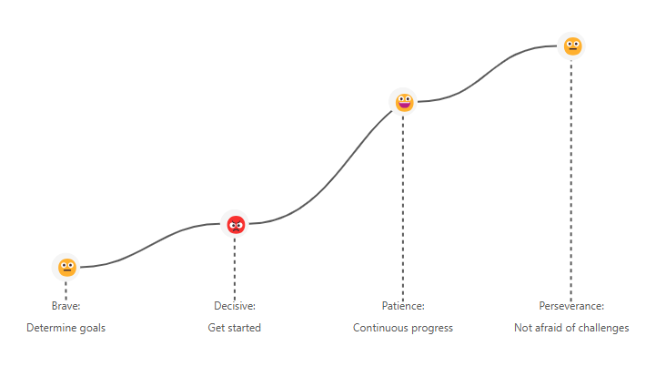

# 🚀 Beyond the Race of Time and Space, We Prove Ourselves Step by Step

### *Each step forward is on our own ladder; looking back, we stand where we once gazed up*

**Language:** [中文](README.md) | **English**

---

## 📖 Table of Contents

- [✨ Core Philosophy](#-core-philosophy)
- [🎯 Eight-Step Growth Methodology](#-eight-step-growth-methodology)
  - [Step 1: Set Clear Goals](#step-1-set-clear-goals)
  - [Step 2: Understand Yourself Deeply](#step-2-understand-yourself-deeply)
  - [Step 3: Harness AI Power](#step-3-harness-ai-power)
  - [Step 4: Persist and Write Your Legend](#step-4-persist-and-write-your-legend)
  - [Step 5: Positive Feedback](#step-5-positive-feedback)
  - [Step 6: Small Goals Support Great Achievements](#step-6-small-goals-support-great-achievements)
  - [Step 7: Showcase Yourself](#step-7-showcase-yourself)
  - [Step 8: Personal Profile Feedback](#step-8-personal-profile-feedback)
- [🎊 Start Your Growth Journey](#-start-your-growth-journey)
- [🏗️ Technical Framework](framework.md)

---

## ✨ Core Philosophy

> **Goals Guide Direction, Accumulation Creates Brilliance** 🌟

In the fast-paced modern life, we are committed to helping everyone find their own rhythm of growth. Through scientific methods and the power of AI, we make every effort more valuable and every accumulation more meaningful.

---

## 🎯 Eight-Step Growth Methodology

### Step 1: Set Clear Goals
**🌟 No More Confusion in Efforts**

<blockquote>
Have you ever been confused about the direction of your efforts? Have you lost yourself in blind busyness?
</blockquote>

Here, we understand that every step of accumulation should have a clear goal. Setting goals is like lighting a lamp in the darkness, illuminating the path forward. We will help you light this lamp, making every effort move towards your dreams.

### Step 2: Understand Yourself Deeply
**🌟 Customize Your Goals**

<blockquote>
Everyone is unique, and so should our goals be.
</blockquote>

Through deep self-analysis, we will create personalized goals for you. Like selecting the most suitable soil for each seed, we ensure your goals match your characteristics while inspiring your potential, truly achieving 'individualized teaching' for a more precise and efficient growth path.

### Step 3: Harness AI Power
**🌟 For More Scientific Goals**

<blockquote>
In this intelligent age, let technology empower your growth.
</blockquote>

We equip you with a powerful AI assistant. It will provide scientific goal-setting suggestions based on your needs and data. Whether it's study plans, fitness goals, or skill improvement, AI can plan precisely for you, making goals not distant dreams but achievable possibilities.

### Step 4: Persist and Write Your Legend
**🌟 Persistence is the Key to Victory**

<blockquote>
Setting goals is just the beginning; persistence is the key to victory.
</blockquote>

We believe that with unwavering persistence, even water can penetrate stone. Here, we will accompany you through every difficult moment, witnessing you bloom with brilliant light from gradual accumulation. Remember, with persistence, every effort will be rewarded.

### Step 5: Positive Feedback
**🌟 Makes Persistence More Powerful**

<blockquote>
Consistent check-ins require not only willpower but also positive encouragement.
</blockquote>

Here, you will receive sincere praise from teachers, parents, or classmates. Every like and encouragement is your driving force, making you no longer alone on the path of accumulation, but filled with warmth and strength.

### Step 6: Small Goals Support Great Achievements
**🌟 Make Check-ins More Meaningful**

<blockquote>
Check-ins should not be mechanical repetition, but progress towards goals.
</blockquote>

Teachers, parents, or classmates will provide supervision and guidance, making every check-in meaningful and directional. From one small goal to another, you will climb step by step, ultimately achieving your own brilliance.

### Step 7: Showcase Yourself
**🌟 Let Accumulation Shine**

<blockquote>
After accumulating for a while, you need a stage to let your efforts be seen.
</blockquote>

We will provide opportunities for you to showcase, whether it's sharing achievements or displaying talents, you will gain a full sense of accomplishment. Because every accumulation deserves to be remembered by the world.

### Step 8: Personal Profile Feedback
**🌟 Goals Continuously Evolve**

<blockquote>
Every goal setting, every check-in, adds color to your personal profile.
</blockquote>

These profiles will feedback into goal setting, forming a perfect closed loop. Your goals will continuously evolve with your growth, making every step more aligned with your needs and closer to your dreams.

---

## 🎊 Start Your Growth Journey

### 🌟 Join Us, Start Your Growth Journey 🌟

**This is not just an APP, this is a journey about accumulation and growth**

Here, you will:
- 🎯 Find clear goals
- 💪 Gain continuous encouragement  
- 📈 Witness your own growth

<blockquote>
Let's together, with every step of accumulation, write our own legend.
</blockquote>

**Download now, start your growth journey, and make every step count!**

---

*© 2024 Step App - Beyond the Race of Time and Space, We Prove Ourselves Step by Step*

